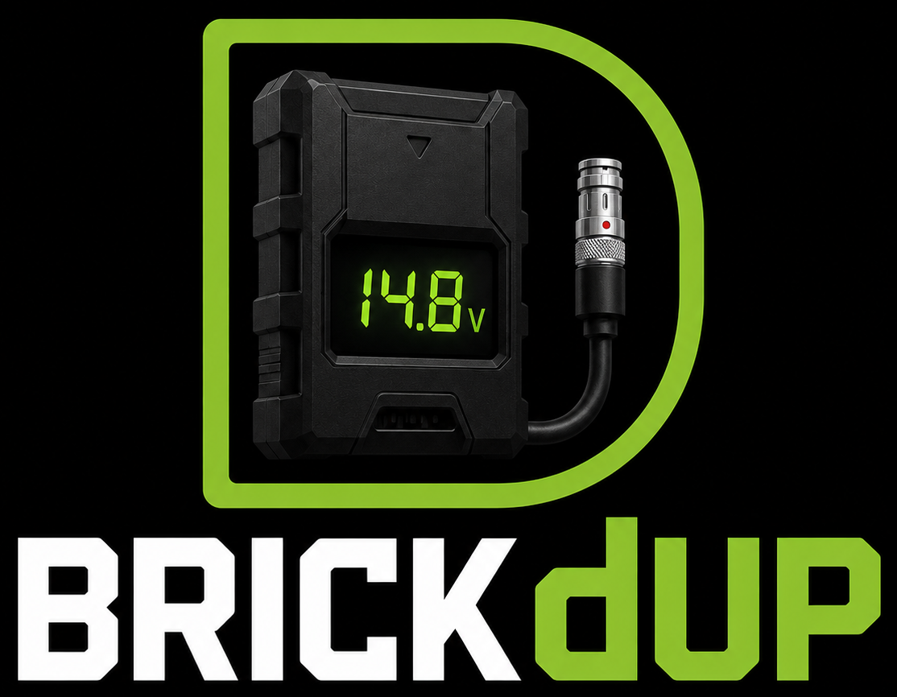

<p align="center"></p>

# brickdup

Wireless battery voltage monitor for film/video sets. LoRa sensor nodes tap into camera batteries and broadcast readings to a handheld receiver with an e-ink display.

## Hardware

All boards: **Heltec WiFi LoRa 32 V3** (ESP32-S3 + SX1262, 915 MHz)

Receiver also has: **Waveshare 2.13" e-Paper HAT V4** (250×122, GDEY0213B74)

### Sensor node variants

| Variant | Battery | Connector | Voltage range | Divider |
|---|---|---|---|---|
| Onboard (`OB`) | 4S Li-Ion | D-Tap or AB 4-pin | up to 16.8V | R1=100kΩ, R2=22kΩ |
| Block (`BL`) | 6S Li-Ion | AB 4-pin (inline) | up to 25.2V | R1=180kΩ, R2=27kΩ |

Voltage divider feeds GPIO7. A 100nF ceramic cap between GPIO7 and GND filters ADC noise. Power the MCU through a buck converter (Pololu D24V10F5 — 36V max input, 5V out) tapped off VBAT. **Do not feed VBAT directly to the Heltec USB or VIN pin.**

📐 **Full wiring (both variants, with diagrams): [WIRING.md](WIRING.md)**
📌 **Pin assignments, button controls & screen layouts: [REFERENCE.md](REFERENCE.md)**
📝 **Firmware version history: [CHANGELOG.md](CHANGELOG.md)** — current: **v0.5.1**

### Pin map

```
LoRa SX1262 (HSPI):   CS=8, DIO1=14, RST=12, BUSY=13 | SCK=9, MISO=11, MOSI=10
ADC (sensor nodes):   VBAT_PIN = GPIO7 (ADC1_CH6)
E-ink (receiver):     CS=5, DC=4, RST=3, BUSY=2 | SCK=6, MOSI=1
```

## Sketches

| File | Flash to |
|---|---|
| **`sensor_universal_heltec_v3/`** | **Recommended** node firmware — one board, 4S **or** 6S, type selectable |
| `sensor_onboard_heltec_v3/` | Legacy onboard-only (4S) node |
| `sensor_block_heltec_v3/` | Legacy block-only (6S) node |
| `receiver_wireless_paper_v1_2/` | The handheld receiver (Heltec Wireless Paper) |
| `bench_ping_test/` | Both V3s, to verify the radio link (set `ROLE_PINGER` per board) |

**Universal node** (`sensor_universal_heltec_v3`) replaces the two single-mode
sketches: one universal divider (200k/22k as built — 2×100k + 22k — 6S-safe with headroom) and a runtime **battery
type** (OB 4S / BL 6S) that sets the thresholds + broadcast type. Pick it on the
config page or **long-press PRG** to toggle. Identical firmware on every node —
no per-unit edits. It shows a big 7-segment voltage and the type in the corner.

> **USB test mode:** the node sketches have `USB_TEST_MODE` (default `1`) that
> reads the board's onboard supply (~4V) instead of the divider, so the
> TX → RX → e-ink chain can be validated over USB-C with nothing wired. Set to
> `0` for real monitoring.

## Node identity

Every node has two names:

- **Permanent id** — auto-derived from the chip's unique MAC at boot. Never
  changes, guaranteed unique, and is the WiFi network name + the receiver's
  tracking key. The **universal** sketch uses a type-independent `ND-7F3A` (so
  toggling battery type updates the node in place); the legacy OB/BL sketches
  use `OB-7F3A` / `BL-7F3A`.
- **User name** — the friendly label you assign over WiFi (`Cam A`). Defaults to
  the permanent id until set. Shown on the OLED + handheld and broadcast.

Because the permanent id comes from the silicon, you flash the **same firmware to
every node** — no per-unit edits. With the universal sketch even the battery
type is a runtime setting, so one firmware truly covers every node.

## Packet format

```
T:<type>,I:<permId>,V:<voltage>,S:<status>[,M:<name>]
```

Example: `T:OB,I:OB-7F3A,V:14.73,S:0,M:Cam A`

- `type` — `OB` or `BL`
- `permId` — permanent unique id (chip-derived), receiver's tracking key
- `voltage` — float, 2 decimal places
- `status` — 0=OK, 1=WARN, 2=CRIT
- `name` — optional friendly name (no commas)

## Naming nodes (WiFi config portal)

Each node hosts a WiFi access point you can join to rename it — no reflashing:

1. Power the node and join WiFi **`Brickdup-OB-7F3A`** (password `brickdup`) —
   the suffix is unique per board, printed on the OLED at boot
2. Open **http://192.168.4.1**
3. Type a **name**, tap Save

The name persists in flash (survives reboot/reflash) and rides along in every
packet, so the handheld shows it automatically.

**Turning WiFi off (saves ~80mA):** no extra hardware needed —

- Tap the node's onboard **PRG button** any time to toggle WiFi on/off, or
- Hit **Turn off WiFi** on the config page when you're done naming.

Press PRG again to bring it back. The on/off choice is **remembered across
reboots** — a node switched off stays off after a power cycle. `WIFI_ON_AT_BOOT`
is only the first-ever-boot default.

## Button controls

| Unit | Single tap | Long press | Triple tap |
|---|---|---|---|
| Node (PRG) | toggle WiFi | — | **power off** |
| Receiver (USER) | page nodes | toggle dashboard | **power off** |

"Power off" is deep sleep (~10–20µA); the screen shows **POWERED DOWN** (white
on black), then **press the button again to wake** (the unit reboots). The
receiver e-ink keeps the POWERED DOWN screen visible while asleep.

Thresholds — Onboard: WARN=13.5V, CRIT=12.8V | Block: WARN=21.0V, CRIT=20.0V

## Radio config

```
Frequency: 915.0 MHz  |  Bandwidth: 125 kHz  |  SF: 9  |  CR: 4/5
Sync word: 0xAB       |  TX power: 17 dBm    |  Preamble: 8
```

All nodes must use identical settings. SF9 gives 50–100m range with obstacles. Up to 12 nodes, 10s interval — no collision concern.

## Build environment

**Arduino IDE 2.x** with the **Heltec ESP32 board package** (Board Manager URL):
```
https://resource.heltec.cn/download/package_heltec_esp32_index.json
```

**Board selection differs per sketch** (the e-ink library requires the exact
board, or it errors with "Wrong build env"):

| Sketch | Tools → Board |
|---|---|
| `receiver_wireless_paper_v1_2` | **Wireless Paper** (search "paper") |
| `sensor_universal_heltec_v3` | Heltec WiFi LoRa 32(V3) |
| `sensor_onboard_heltec_v3` | Heltec WiFi LoRa 32(V3) |
| `sensor_block_heltec_v3` | Heltec WiFi LoRa 32(V3) |

Common settings: USB CDC On Boot → **Enabled** | Upload Speed → 921600

**OTA updates (no USB after the first flash):** every unit's web portal has a
`/update` page. Build a `.bin` via **Sketch → Export Compiled Binary**, join the
unit's WiFi, open its `/update` page (linked from the config page / dashboard),
and upload the matching `.bin` — it flashes the spare partition, verifies, and
reboots. Upload the OB `.bin` to onboard nodes, BL to block nodes, receiver to
the receiver (the page shows which it expects).

> No partition setting needed: the Heltec WiFi LoRa 32 V3 and Wireless Paper
> both default to the `default_8MB` scheme, which already has two ~3.3MB app
> slots (OTA-capable). There's no "Partition Scheme" menu for these boards
> because the partition is fixed — and it's the right one.

### Prebuilt firmware (CI)

GitHub Actions compiles all three sketches on **every push** and on version
tags — no local toolchain needed to get a `.bin`:

- **Every push:** download `brickdup-firmware` from the
  [latest Actions run](../../actions) (artifacts: `brickdup_onboard.bin`,
  `brickdup_block.bin`, `brickdup_receiver.bin`).
- **Tagged releases:** push a `vX.Y.Z` tag → the `.bin`s are attached to a
  [GitHub Release](../../releases).

Grab the matching `.bin` and push it to a unit via its `/update` page. To cut a
release: bump `FW_VERSION` in all three sketches, update `CHANGELOG.md`, commit,
then `git tag v0.5.1 && git push --tags`.

**Libraries (Library Manager):**
- `RadioLib` by Jan Gromeš — all three sketches
- `Heltec ESP32 Dev-Boards` by Heltec — node OLED (`HT_SSD1306Wire.h`)
- `heltec-eink-modules` by todd-herbert — receiver e-ink (pulls in Adafruit GFX)

## BOM

| Part | Source | ~Cost |
|---|---|---|
| Heltec WiFi LoRa 32 V3 (915 MHz) — nodes | Amazon | $22 ea |
| Heltec Wireless Paper (915 MHz) — receiver | Amazon | $22 |
| Pololu D24V10F5 buck converter (per node) | Pololu | — |
| Node LiPo — MakerHawk 1100mAh 1S (JST 1.25) | Amazon `B0F9YSFV4T` | 4-pack |
| Receiver LiPo — MakerFocus 3000mAh 1S (JST 1.25) | Amazon `B08T6GT7DV` | 4-pack |
| D-Tap male connectors | B&H (CT-DTAP-M) | — |
| AB 4-pin connectors | Pinknoise Systems / Trew Audio | — |
| 1% metal film resistors — universal: 200k, 27k (legacy: 100k/22k, 180k/27k) | — | — |
| 100nF ceramic caps (104) | — | — |

## Roadmap

- [x] Bench ping test (verify radio link before analog wiring)
- [x] Receiver paging (USER button cycles pages when >5 nodes)
- [x] Fuel gauge: SoC % + rough time-to-empty per node (voltage-based)
- [x] Calibration (enter true voltage on the web page; gain factor saved to NVS)
- [x] RSSI signal bars per node on the receiver
- [x] Receiver web dashboard (live node table on your phone; long-press USER)
- [x] OTA firmware update via the web portal on all units (/update page)
- [x] Captive portal — config page auto-pops on WiFi connect
- [x] Universal node — one sketch, runtime 4S/6S battery type (web or long-press)
- [x] Prebuilt firmware via CI (GitHub Actions builds .bin on every push)
- [ ] Channel/group selection — separate networks via distinct frequency +
      sync word per channel, set on the node web page and on the receiver,
      NVS-stored. Lets multiple brickdup systems coexist (e.g. 1st/2nd unit)
- [ ] WiFi client (STA) mode — units optionally join a local network (DHCP or
      static IP) instead of hosting their own AP, each reachable at a unique
      mDNS host like `brickdup-7f3a.local` (chip-serial based).
      Credentials set via the AP config page, stored in NVS. Reach/OTA any unit
      from one device on the production WiFi
- [ ] Trusted WiFi networks — a saved list of known SSIDs the unit auto-joins
      (STA) when one is in range and WiFi is on, falling back to its own AP
      otherwise. Set via the config page, stored in NVS
- [ ] BLE / companion phone app — receiver exposes node data over Bluetooth LE
      (GATT, mirroring the `/data` JSON) for a phone app: live view + push
      notifications for CRIT/DEAD batteries (alerts even with the handheld in a
      bag), no WiFi join needed. NimBLE stack; LoRa is a separate radio, BLE
      time-shares 2.4GHz with WiFi
- [ ] iOS app — native companion that keeps a **persistent live readout** of all
      nodes and fires **push/local notifications** on CRIT/DEAD/LOST (even when
      backgrounded or the phone is locked). Connects via BLE (Core Bluetooth
      background mode) to the receiver; the front-end for the BLE item above
- [ ] Bridge LiPo on nodes — small backup cell (buck keeps it charged) so a node
      stays alive to report a **camera battery removed/dead for sure** (vs just
      going silent), survives swaps, and reports its own LiPo level. Replaces the
      receiver's inferred DEAD with an explicit reported one
- [ ] VCLX block-battery mode (NiMH) — the blocks in use are Anton/Bauer
      **VCLX NM2** (600Wh **NiMH**), tapped at a 14.4V 4-pin XLR. Per the
      [manual](https://www.antonbauer.com/wp-content/uploads/2023/07/ab_86750174-4980_0-vclx_nm2-manual_en.pdf)
      spec table, only 28V/48V (+5V USB) are regulated; the 4-pin XLRs are
      **variable 12–17V** (pack-following) — so the node *does* see a real
      discharge curve. But the chemistry breaks the Li-ion fuel gauge: NiMH
      holds a flat ~14.4V (1.2V/cell × 12) for most of the discharge, knees
      at ~13.2V, and the battery hard-cuts its output at **12.0V** (output
      vanishes → bridge LiPo keeps the node alive to report DEAD). Repurpose
      BL mode → NiMH profile: thresholds ≈ WARN 13.2 / CRIT 12.4, and
      suppress SoC%/time-to-empty (or fit a rough NiMH curve) — the Li-ion
      curve reads nonsense on the flat middle. Verify thresholds on a real
      pack: meter the XLR full (~16.8V) vs drained. Heads-up for the divider
      bench test: cap input at ~17V for this mode, not 25.2V
- [ ] CRIT buzzer alert on receiver
- [x] NVS persistence — receiver remembers nodes across reboots (clear on dashboard)
- [ ] Deep sleep on sensor nodes (~10µA between transmissions)
- [ ] PCB design (sensor node, two variants or DNP options)
